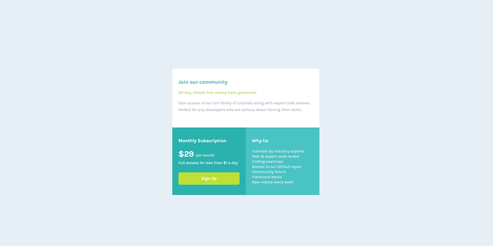

# Frontend Mentor - Single price grid component solution

This is a solution to the [Single price grid component challenge on Frontend Mentor](https://www.frontendmentor.io/challenges/single-price-grid-component-5ce41129d0ff452fec5abbbc). Frontend Mentor challenges help you improve your coding skills by building realistic projects. 

## Table of contents

- [Overview](#overview)
  - [The challenge](#the-challenge)
  - [Screenshot](#screenshot)
  - [Links](#links)
- [My process](#my-process)
  - [Built with](#built-with)
  - [What I learned](#what-i-learned)
  - [Continued development](#continued-development)
  - [Useful resources](#useful-resources)
- [Author](#author)
- [Acknowledgments](#acknowledgments)


## Overview

### The challenge

Users should be able to:

- View the optimal layout for the component depending on their device's screen size
- See a hover state on desktop for the Sign Up call-to-action

### Screenshot




### Links

- Solution URL: [Add solution URL here](https://your-solution-url.com)
- Live Site URL: [Add live site URL here](https://your-live-site-url.com)

## My process

### Built with

- Semantic HTML5 markup
- CSS custom properties
- CSS Grid
- Mobile-first workflow
- [Styled Components](https://styled-components.com/) - For styles


### What I learned

I'd like to use this section to recap what I learned about using grid. Initially, I chose to complete this challege not untilizing the grid. However, halfway I soon realized that my markup..specifically the stylesheet where becoming difficult to work with. What I've learn is that with grid you are able to work with specific properties that you do not have the luxury of working with in css.

To see how you can add code snippets, see below:

```scss
@media (min-wdith: 23.4375em),(max-width: 40em) {
    .wrapper-grid {
        position: relative;
    }
}
@media (min-width: 40em) {
    

    .grid-col-span-2 {
        grid-column: span 2;
    
    }
    .wrapper-grid{
        grid-template-columns: 1fr 1fr;
     
    }


    .footer {
        grid-column: 2;
        
    }
}
```


### Continued development

I would like to build off of this challege. Possibly add additional columns and or rows to get a good feel of the grid and what the best usecases might be. 


### Useful resources

- [Example resource 1](https://youtu.be/rg7Fvvl3taU) - This helped me truly wrap my head around using the grid. I really liked this pattern and will use it going forward.
- [Example resource 2](https://developer.mozilla.org/en-US/) - This is an amazing wedsite where I find anything that needs to be found. I'd recommend it to anyone still learning this concept.

## Author

- Website - [Amario Jones]()
- Frontend Mentor - [@Qstar12](https://www.frontendmentor.io/profile/Qstar12)
- Twitter - [@jones_amario](https://twitter.com/jones_amario)


## Acknowledgments

Thanks to all of those who support my journey. Thanks to (https://www.frontendmentor.io/)
